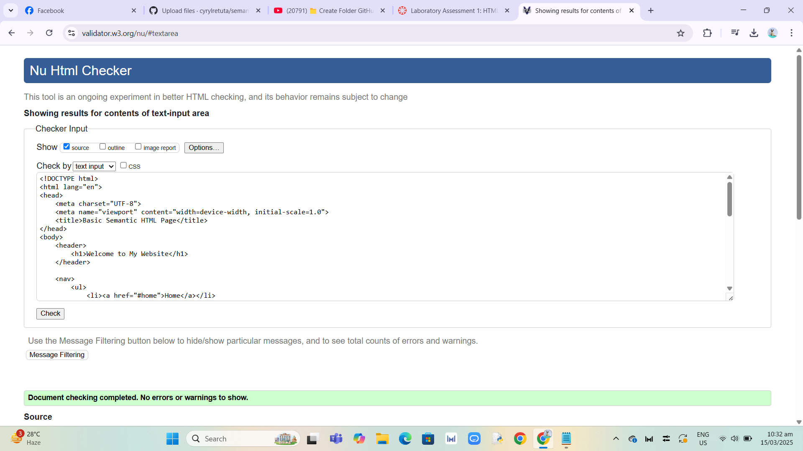

# Semantic HTML Webpage  

## Purpose  
This webpage demonstrates the use of semantic HTML elements to create a well-structured and accessible webpage.  

## Semantic Elements Used  
- `<header>`  
- `<nav>`  
- `<article>`  
- `<section>`  
- `<aside>`  
- `<footer>`  

## Accessibility Considerations  
- Used proper heading hierarchy.  
- Included `alt` attributes for images.  
- Ensured logical HTML structure for screen readers.  

## Validation  
The HTML file was validated using the W3C Validator. Below is a screenshot of the validation results.  

  

## Live Page  
[View on GitHub Pages](https://cyrylretuta.github.io/semantic-html-lab/)
